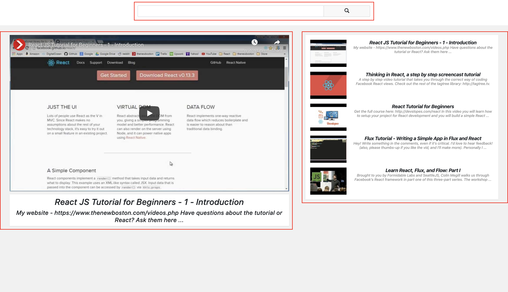

# Welcome to recast.ly!

Recast.ly is a front end project that allowed the two of us to dive deep into older methods of building an app like AJAX and jQuery. A simple, single-paged app to display videos that allows recast.ly to be a stripped down version of YouTube.

</img>

## User Stories

- As a user, I want to watch YouTube videos in the browser.
- As a user, I want to search for new videos.
- As a user, I want to see recommended videos based on my search.

## Stack

| Front End     |   API          |
| ------------- |  ------------- |
| </img>  | </img>  |
| </img>  |

### Front-End

To keep things simple, we utilized React and jQuery to build an app that could display the needs of the user without risking functionality.

### APIs

To display videos and allow for search queries, we used YouTube, our model for what this project would be.

## Challenges & Learning

It was interesting for us to take nonconventional was to build a front end app without using the full stack. Pair programming was a tremendous help in completing this project in a short time period.

### Challenges

- This was our first experience with an API. We had to learn everything from the beginning to ensure that everything worked properly.
- Understanding the ins and outs of AJAX was a struggle for two developers that have utilized newer technologies, but we came out stronger than ever.

### Learnings

- Trust was a big learning experience for the both of us as we dove deep into the front end to mimic something that was already iconic.
- Communication built us up more than we thought it would. We were able to pick up on our strengths and weaknesses to complete the project quickly and efficiently.

#### Contributors

Collin Fairlie and Arjun Sharma